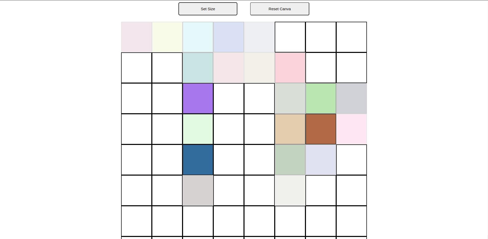

# etch-a-sketch

## Links
- [Live preview](https://azanra.github.io/etch-a-sketch/)
- [Assignment page](https://www.theodinproject.com/lessons/foundations-etch-a-sketch)

## About
This project contain a simple sketchpad or Etch-A-Sketch
User can hover on canva to draw something. User can set
the grid size or reset the canva. The project focus on 
manipulating the dom, css with javascript.

## Screenshot
